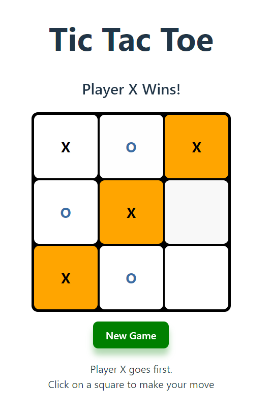

# Tic Tac Toe

A simple and interactive Tic Tac Toe game built with React.

---

## Description

This project implements a classic Tic Tac Toe game with React hooks. Players alternate turns placing X and O on a 3x3 grid. The game detects a winner or a tie and highlights the winning combination.

---



## Features

- 3x3 Tic Tac Toe board  
- Turn-based gameplay between Player X and Player O  
- Winner detection with highlighted winning squares  
- Tie detection  
- New game reset functionality  
- Smooth UI transitions and animations  
- Mobile responcive

---

## Technologies Used

- React (functional components with hooks)  
- CSS for styling and animations  

---

## How to Play

- Player X starts first.  
- Click on any empty square to place your mark (X or O).  
- The game automatically switches turns.  
- If a player aligns three marks horizontally, vertically, or diagonally, that player wins, and the winning combination is highlighted.  
- If all squares are filled without a winner, the game ends in a tie.  
- Press the "New Game" button to restart.  

---

## Setup & Run Locally

1. Clone the repository:
    ```bash
    git clone git@github.com:m-pokrovskii/Tic-Tac-Toe.git
    ```
2. Navigate to the project directory:
    ```bash
    cd tic-tac-toe
    ```
3. Install dependencies:
    ```bash
    npm install
    ```
4. Start the development server:
    ```bash
    npm run dev
    ```
5. Open your browser and go to:
    ```
    http://localhost:5173/
    ```

---

## Future Improvements

- Add AI opponent  
- Add player score tracking  
- Add sound effects and improved animations  